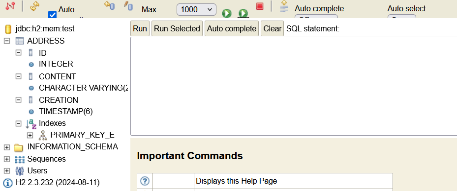
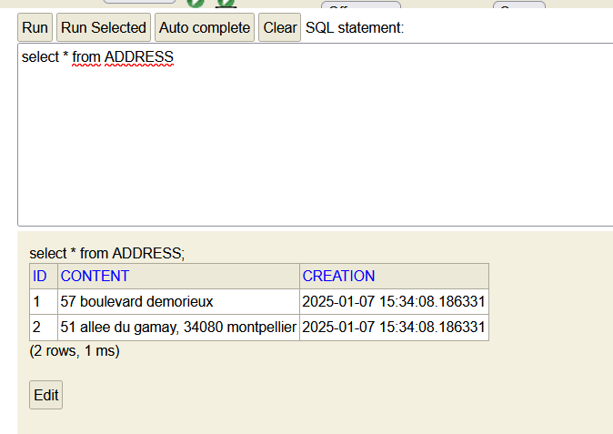

# Dependencies
## Web
The web dependency provide developpers with all
needed essentials tools to create web-based applications. It also brings
RESTful web severvices into hands to developpers

## JPA
An ORM Interface, working in pair with Hibernate that helps developpers manage data between java object/class and
relational database in java

## Hibernate
A framework and ORM used to provide implementation of
JPA methods

## H2
H2 is a RDMS based on java often used as client-server application

## DevTools
Simplifies the debugging process and restarts the application in 
any changes.

## Thymeleaf
Java template (a set of code that helps developer use static template files in application) for creating and processing HTML, XML, JS, CSS and text

# Etape 13
#### 1. Avec quelle partie du code avons-nous paramétré l'url d'appel /greeting ?
 Il s'agit de ce bout de code dans la classe HelloWorldController 
    
    @GetMapping("/greeting")
#### 2. Avec quelle partie du code avons-nous choisi le fichier HTML à afficher ?
 Le renvoie de la fonction greeting dans la partie suivante

```
@GetMapping("/greeting")
public String greeting(@RequestParam(name = "nameGET",required = false, defaultValue = "World") String 
nameGET, Model model)
{
    model.addAttribute("nomTemplate", nameGET);
    return "greeting";
}
```

#### 3. Comment envoyons-nous le nom à qui nous disons bonjour avec le second lien ?
   Ceci ce fait grace a la variable "nomTemplate". Quand l'utilisateur entre le lien http://localhost:9090/greeting?nameGet?=Ensim
   Il souhaite ainsi acceder a la page greeting en affectant la valeur "Ensim" a la variable nameGet. Sinon elle a pour valeur
   par defaut World.
   Quand ce dernier a une valeur elle l'affect en retour a "nomTemplate" et ce dernier sera a son tour affichee dans le html

#### Etape 17
   Quand on redemarre la page on voit qu'une table Addresse a ete aujoutee a la base de donnees selon la classe Addresse qu'on
   vient de creer
   

#### Etape 18

   Quand on cree la classe Addresse, on specefie grace a l'annotation "Entity" a Hibernate
   que nous voulons stocker Addresse dans notre base de donnee. Une fois cela fait, Hibernate fait 
   la correspondance entre les classed ayant l'annotation 'Entity' et notre base de donnees puis cree une table
   pour chaque classe ayant cette annotation si la table n'existe pas deja. Hibernate prend en 
   charge toutes les tâches liées à la creation de ces objets sur la base des mécanismes et des modèles O/R appropriés.

#### Etape 19
#### Etape 20
On fait une requete qui affiche tous les elements de la table Addresse.
Oui on y voit tout le contenu du fichier data.sql


#### Etape 23
@Autowired est une annotation de Spring Framework qui permet l'injection de dépendances
pour les classes Java. Elle permet à Spring d'injecter 
automatiquement des dépendances dans la classe, éliminant ainsi 
le besoin d'une configuration manuelle. Cette annotation peut être 
utilisée pour injecter des dépendances dans les champs, 
les méthodes et les constructeurs.